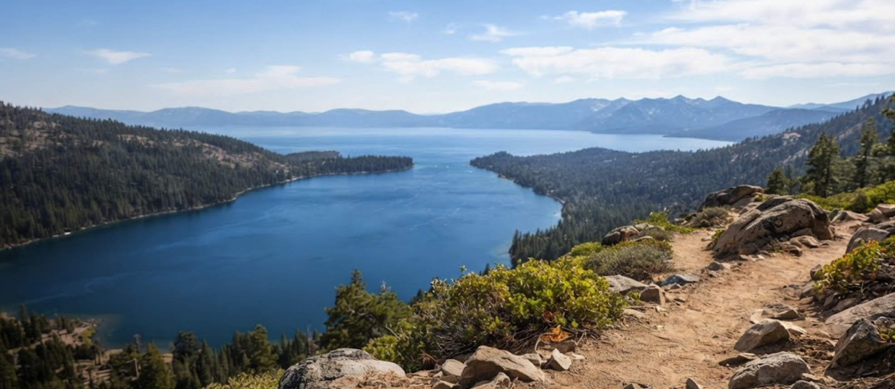

# CamelUp - Tahoe

Camel Up helps hikers tap into the knowledge of people who've actually been on the trail.

Ask questions about any hike and get quick, practical insights gathered from public trail reports, forums, and hiker discussions. Whether you're wondering about water sources, trail conditions, bugs, crowds, parking, or what gear to bring, Camel Up surfaces the advice hikers wish they had known before heading out.

The goal is simple: help you prepare better, hike smarter, and make the most of your adventure. Before the long dry stretch, Camel Up.

## Setup

```bash
cd ai201-project1
python -m venv .venv
source .venv/bin/activate
pip install -r requirements.txt
cp .env.example .env   # add your Groq API key
python app.py          # open http://127.0.0.1:7860
```

---

## Domain

Trail planning and hiking conditions — hiker reviews, trip reports, and unofficial trail knowledge covering water availability, trail conditions, seasonal hazards, parking, crowds, wildlife encounters, navigation challenges, and gear recommendations. Official park websites provide maps, distances, elevation profiles, and regulations, but they rarely answer the questions hikers actually ask before a trip: Is the creek crossing passable? Does the parking lot fill before sunrise? Is the trail overgrown? Are the mosquitoes bad this time of year? Hikers share this knowledge across Reddit threads, trail review sites, blogs, and outdoor forums. This system makes that collective trail wisdom searchable in one place, helping hikers prepare better and get the most out of their adventures.


---

| # | URL or file path | Sources |
|---|------------------|--------|
| 1 | EagleLakeTrail.txt | |
| 2 | MountTallacTrail.txt | |
| 3 | TahoeRimTrail.txt | |
| 4 | RubiconTrail.txt | |
| 5 | EagleFallsTrail.txt | |
| 6 | CascadeFallsTrail.txt | |
| 7 | FiveLakesTrail.txt | |
| 8 | ShirleyCanyonTrail.txt | |
| 9 | EagleRockHikingTrail.txt | |
| 10 | MountRoseTrail.txt | |
| 11 | FlumeTrail.txt | |
| 12 | MarletteLakeTrail.txt | |
| 13 | MonkeyRockTrail.txt | |
| 14 | SpoonerLakeToMarletteLakeTrail.txt | |
| 15 | CastlePeakTrail.txt | |
| 16 | FreelPeakTrail.txt | |
| 17 | GraniteChiefTrail.txt | |
| 18 | GlenAlpineTrail.txt | |
| 19 | PaigeMeadowsTrail.txt | |
| 20 | DonnerLakeRimTrail.txt | |

**Ingestion pipeline:** `ingest.py` loads all `.txt` files from `documents/`, strips HTML tags and boilerplate (navigation text, cookie banners, share buttons) via regex, normalizes whitespace, then chunks the cleaned text. Raw text is read as UTF-8; no live scraping is used.

---

## Chunking Strategy

**Chunk size:** 400 characters

**Overlap:** 80 characters

**Why these choices fit your documents:**

My corpus is review-heavy — most documents are 1–3 short paragraphs, not long-form guides. Four hundred characters captures 2–3 sentences of opinion text, which is enough for a single retrievable thought (e.g., one reviewer's take on wait times). I split on paragraph boundaries first to keep reviews intact, then use overlapping fixed windows for paragraphs longer than 400 characters. The 80-character overlap prevents losing context when a key fact spans a chunk boundary.

**Preprocessing before chunking:** HTML tag removal, HTML entity cleanup, boilerplate phrase removal, whitespace normalization.

**Final chunk count:** 

### Sample Chunks
